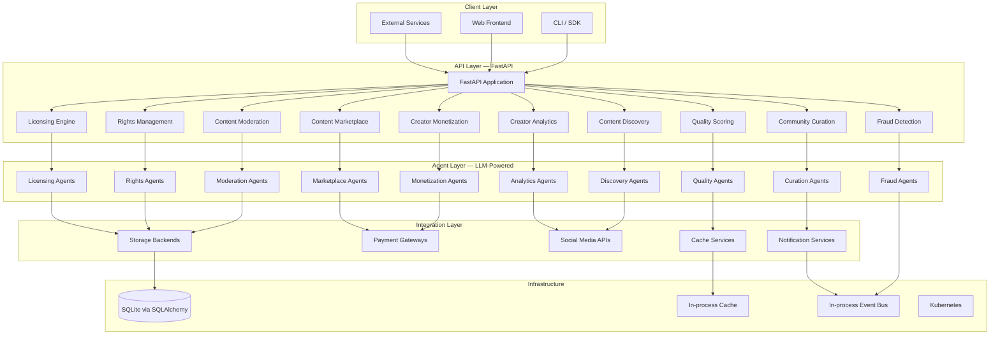
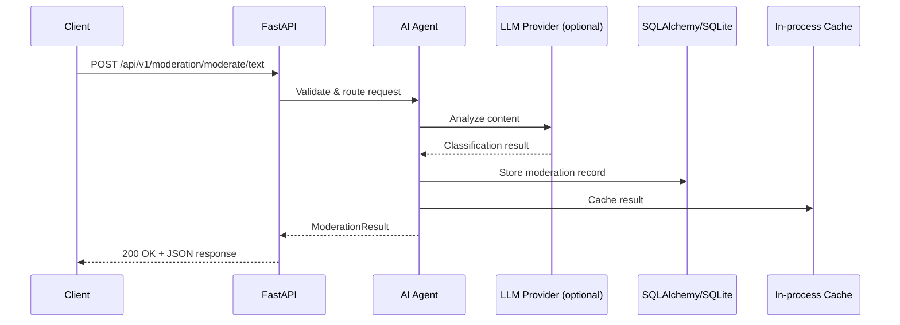
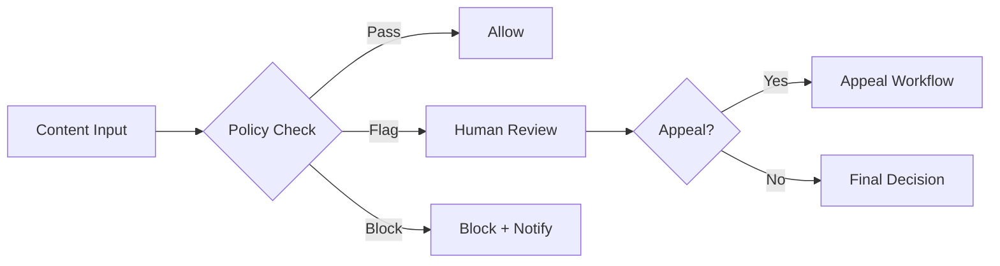

# UGC Marketplace

<div align="center">

[](https://github.com/AAH20/ugc-marketplace/actions)
[](https://github.com/AAH20/ugc-marketplace/actions)
[](https://www.python.org/)
[](https://fastapi.tiangolo.com/)
[](LICENSE)
[](https://docs.astral.sh/ruff/)
[](https://www.docker.com/)
[](https://kubernetes.io/)

**Unified agentic AI platform for content marketplace operations, GTM launch management, video generation, and broker channel distribution — built for MENA and emerging markets.**

> **Status:** Production-ready · 513 tests passing · 117 Python files · 23K+ lines of code

[Quick Start](#quick-start) · [Features](#features) · [New Modules](#new-modules) · [API Reference](#api-reference) · [Deployment](#deployment) · [Development](#development) · [Contributing](#contributing)

</div>

---

## Table of Contents

- [Project Overview](#project-overview)
- [Architecture](#architecture)
- [Quick Start](#quick-start)
- [Features](#features)
- [API Reference](#api-reference)
- [Deployment](#deployment)
- [Development](#development)
- [Contributing](#contributing)
- [License](#license)
- [Changelog](#changelog)

---

## Project Overview

UGC Marketplace is a **unified agentic AI platform** that consolidates ten separate UGC marketplace projects into a single, standalone, modularized Python application. It provides a comprehensive suite of AI-powered tools for content marketplace operations — from content moderation and rights management to creator monetization and fraud detection.

### Why UGC Marketplace?

- **Unified Platform** — Ten independent marketplace services consolidated into one cohesive API
- **Agentic AI** — Each module uses LLM-powered agents for intelligent decision-making
- **Production-Ready** — Built with FastAPI, async I/O, structured logging, and comprehensive testing
- **Cloud-Native** — Docker Compose for local development, Helm charts for Kubernetes deployment
- **Type-Safe** — Full mypy strict mode, Pydantic v2 models, and type hints throughout

### Tech Stack

| Layer | Technology |
|-------|-----------|
| **Language** | Python 3.11+ |
| **Framework** | FastAPI + Uvicorn |
| **Validation** | Pydantic v2 |
| **Database** | SQLAlchemy 2.0 — SQLite by default (`app/database.py`, `app/gtm/db.py`), any SQLAlchemy URL supported |
| **Cache** | In-process (pluggable); no external cache server required |
| **Message Queue** | In-process (pluggable) |
| **LLM** | Optional — `requirements.txt` ships no LLM SDK; agent modules import provider SDKs lazily and are skipped when absent |
| **Logging** | structlog |
| **Testing** | pytest + pytest-asyncio + pytest-cov (513 passing) |
| **Linting** | ruff + mypy (strict) |
| **Packaging** | hatchling |
| **Deployment** | Docker + Helm + Kubernetes |

---

## Architecture



### Data Flow



---

## Quick Start

### Prerequisites

- **Python** 3.11 or higher (3.12 used in CI and Docker images)
- **Docker** 24.0+ (optional, for containerized setup)
- **No external services required** — the app runs on SQLite by default with no cache server, message broker, or LLM key
- **Optional:** an LLM provider API key enables the agentic features (see [LLM Agents](#cost-optimized-model-routing))

### Option 1: Docker Compose (Recommended)

```bash
# Clone the repository
git clone https://github.com/AAH20/ugc-marketplace.git
cd ugc-marketplace

# Copy environment variables (optional — sensible defaults are built in)
cp docker/.env.example .env

# Start the stack
docker compose up -d

# Verify health (the app exposes /health)
curl http://localhost:8000/health
```

### Option 2: Local Development

```bash
# Clone and enter the project
git clone https://github.com/AAH20/ugc-marketplace.git
cd ugc-marketplace

# Create virtual environment
python -m venv .venv
source .venv/bin/activate

# Install dependencies
# requirements.txt is the supported install path and is what the Docker image uses.
# It ships no vendor SDKs (no Redis client, no asyncpg, no Kafka client, no LLM SDK).
pip install -r requirements.txt

# Copy environment variables (optional — sensible defaults are built in)
cp docker/.env.example .env

# Start the server
# `app.main:app` is the entrypoint used by the Dockerfile and docker-compose.
# It needs SQLAlchemy's asyncio support (greenlet), which requirements.txt provides.
uvicorn app.main:app --reload --port 8000

# Verify health
curl http://localhost:8000/health
```

> **Which entrypoint?** `app.main:app` (broker/channel API, `app/`) is what the Dockerfile,
> docker-compose, and health check use, and it boots from `requirements.txt` alone.
> The wider `src/ugc_marketplace` package exposes a second app (`ugc_marketplace.main:app`,
> installed via `pip install -e .`); its optional agentic modules import provider SDKs
> lazily, so anything whose SDK is absent is skipped rather than fatal.

### Option 3: Kubernetes (Helm)

```bash
# Add the Helm repo
helm repo add ugc-marketplace https://AAH20.github.io/ugc-marketplace

# Install with default values
helm install ugc-marketplace ugc-marketplace/ugc-marketplace \
  --namespace ugc-marketplace \
  --create-namespace

# Or install from local chart
helm install ugc-marketplace ./helm \
  --namespace ugc-marketplace \
  --create-namespace \
  --set ingress.hosts[0].host=ugc-marketplace.yourdomain.com
```

### Verify Installation

Once running, visit:

| Endpoint | Description |
|----------|-------------|
| `http://localhost:8000/docs` | Swagger UI (interactive API docs) |
| `http://localhost:8000/redoc` | ReDoc (alternative API docs) |
| `http://localhost:8000/openapi.json` | OpenAPI schema |
| `http://localhost:8000/api/v1/health` | Health check |

### Quick API Test

```bash
# Health check
curl http://localhost:8000/api/v1/health

# Moderate text content
curl -X POST http://localhost:8000/api/v1/moderation/moderate/text \
  -H "Content-Type: application/json" \
  -d '{"content": "Hello world", "content_type": "text", "user_id": "user-123"}'

# Search content
curl "http://localhost:8000/api/v1/discovery/search?query=python+tutorial&limit=5"
```

---

## Features

### 1. Content Moderation Pipeline

AI-powered moderation for text, image, and video content with policy enforcement and appeal handling.

- **Multi-modal analysis** — Text, image, and video content moderation
- **Policy engine** — Regex/keyword matching with configurable severity levels
- **Appeal workflow** — Full appeal submission, review, and resolution pipeline
- **Batch processing** — Moderate up to 100 items in a single request
- **Confidence scoring** — Configurable threshold (default: 0.7) for automated actions



### 2. Creator Monetization

Comprehensive revenue analytics, payout management, and subscription tracking.

- **Revenue analytics** — Track revenue across multiple streams (subscriptions, tips, merchandise, sponsorships)
- **Payout management** — Automated payout calculation and scheduling
- **Subscription management** — Tier management with churn tracking
- **Forecasting** — Linear regression-based revenue forecasting
- **Multi-gateway** — Stripe, PayPal, and Patreon integrations

### 3. Content Discovery

Semantic search and personalized recommendations powered by vector embeddings.

- **Semantic search** — Vector embedding-based content search
- **Personalized recommendations** — User-specific content suggestions
- **Trend detection** — Real-time trending content identification
- **Search explanation** — Transparent reasoning for search results

### 4. Rights Management

Copyright protection, license management, and infringement detection.

- **Copyright detection** — Automated infringement identification
- **License validation** — License detection and compliance verification
- **Usage tracking** — Content usage monitoring and reporting
- **Takedown workflow** — DMCA takedown request processing

### 5. Quality Scoring

Multi-dimensional content quality analysis with actionable improvement suggestions.

- **Readability** — Flesch-Kincaid readability scoring
- **Originality** — Content uniqueness analysis
- **Engagement potential** — Predicted engagement scoring
- **SEO optimization** — Search engine optimization scoring
- **Improvement suggestions** — AI-generated content improvement recommendations

### 6. Fraud Detection

Real-time transaction monitoring and anomaly detection.

- **Anomaly detection** — Statistical anomaly identification
- **Pattern matching** — Known fraud pattern detection
- **Risk scoring** — Multi-factor risk assessment
- **Account analysis** — Account-level fraud risk profiling
- **Real-time monitoring** — Continuous transaction monitoring with alerts

### 7. Creator Analytics

Deep audience insights and content performance tracking across platforms.

- **Audience analysis** — Demographics and behavior analysis
- **Content performance** — Per-content engagement metrics
- **Growth prediction** — Creator growth trajectory forecasting
- **Revenue tracking** — Cross-platform revenue aggregation
- **Platform integrations** — YouTube, Twitter, Instagram, TikTok

### 8. Licensing Engine

Automated license agreement generation, negotiation, and compliance tracking.

- **Agreement generation** — AI-assisted license agreement creation
- **Terms negotiation** — Automated negotiation workflow
- **Compliance tracking** — License compliance monitoring
- **Royalty calculation** — Automated royalty computation
- **Contract analysis** — AI-powered contract risk assessment

### 9. Community Curation

Intelligent content curation with quality filtering and trend surfacing.

- **Content ranking** — Multi-factor content ranking
- **Quality filtering** — Automated quality assessment
- **Topic clustering** — Content categorization and clustering
- **Trend surfacing** — Emerging trend identification
- **Curation explanation** — Transparent curation reasoning

### 10. Content Marketplace

Full marketplace functionality with listing management and transaction processing.

- **Listing management** — CRUD operations for marketplace listings
- **Pricing optimization** — AI-driven pricing recommendations
- **Transaction processing** — End-to-end transaction lifecycle
- **Trust scoring** — User trust and reputation scoring
- **Marketplace analytics** — Demand prediction and market insights

---

## New Modules

### GTM Launch Platform
- Campaign management with database persistence
- Launch strategy generation with readiness scoring
- Channel performance analysis with ROAS optimization
- Competitor research and counter-strategy generation

### Video Generation
- HyperFrames cloud rendering integration
- Remotion Lambda rendering integration
- VideoClaw CLI integration for AI-generated video
- Quality assessment and engagement prediction

### Broker Channel (MENA)
- Broker management with MENA-specific fields (AED/SAR/EGP)
- Commission tracking and payout management
- Arabic-first content generation with dialect awareness
- Dashboard with real-time metrics

### Cost-Optimized Model Routing
- Tiered model registry (`src/model_router/__init__.py`): free → budget → paid
- Free tier for orchestration (gpt-oss-20b, llama-3.3-70b, deepseek-r1)
- Budget tier for research (gemini-flash-lite, deepseek-v4-flash)
- Paid tier for code generation (gpt-4o, claude-sonnet-4)
- Per-model token cost table used for fallback chains and cost tracking
- Routing is a local policy layer — no vendor SDK or API key is needed to import or test it

### Real-Time Monitoring
- WebSocket streaming for live campaign metrics
- Alerting system for anomalies (spend spikes, CTR drops, ROAS thresholds)
- Performance optimization recommendations

## API Reference

The API is RESTful and returns JSON. Base URL: `http://localhost:8000/api/v1`

### Authentication

```
X-API-Key: your-api-key
```

> **Note:** In production, configure proper authentication via OAuth2, JWT, or API gateway.

### Endpoints Summary

| Module | Endpoint | Methods | Description |
|--------|----------|---------|-------------|
| **Health** | `/health` | GET | Service health check |
| | `/health/ready` | GET | Readiness probe |
| | `/health/live` | GET | Liveness probe |
| **Moderation** | `/moderation/moderate/text` | POST | Moderate text content |
| | `/moderation/moderate/image` | POST | Moderate image content |
| | `/moderation/moderate/video` | POST | Moderate video content |
| | `/moderation/moderate/batch` | POST | Batch moderation (1-100 items) |
| **Monetization** | `/monetization/metrics` | GET, POST | Record/list metrics |
| | `/monetization/reports` | POST, GET | Generate/retrieve reports |
| | `/monetization/forecast` | POST | Forecast metrics |
| | `/monetization/revenue/{creator_id}` | GET | Revenue report |
| **Discovery** | `/discovery/search` | GET | Semantic content search |
| | `/discovery/recommendations/{user_id}` | GET | Personalized recommendations |
| | `/discovery/trending` | GET | Trending content |
| **Rights** | `/rights/licenses` | GET, POST | License management |
| | `/rights/licenses/{id}` | GET, DELETE | License operations |
| | `/rights/detect` | POST | License detection |
| | `/rights/infringement/report` | POST | File infringement report |
| | `/rights/takedown/request` | POST | Submit takedown request |
| | `/rights/usage/record` | POST | Record content usage |
| | `/rights/validate` | POST | Validate usage rights |
| **Quality** | `/quality/score` | POST | Score content (all dimensions) |
| | `/quality/score/readability` | POST | Readability score |
| | `/quality/score/originality` | POST | Originality score |
| | `/quality/score/engagement` | POST | Engagement score |
| | `/quality/score/seo` | POST | SEO score |
| | `/quality/improvements` | POST | Improvement suggestions |
| | `/quality/dimensions` | GET | List scoring dimensions |
| **Fraud** | `/fraud/analyze` | POST | Analyze transaction |
| | `/fraud/analyze/batch` | POST | Batch transaction analysis |
| | `/fraud/patterns/detect` | POST | Detect fraud patterns |
| | `/fraud/anomalies/detect` | POST | Detect anomalies |
| | `/fraud/risk/score` | POST | Score transaction risk |
| | `/fraud/accounts/analyze` | POST | Analyze account risk |
| | `/fraud/monitoring/start` | POST | Start monitoring |
| | `/fraud/monitoring/stop` | POST | Stop monitoring |
| **Analytics** | `/analytics/growth/{creator_id}` | GET | Growth prediction |
| | `/analytics/content/{content_id}` | GET | Content performance |
| | `/analytics/audience/{creator_id}` | GET | Audience analysis |
| | `/analytics/revenue/{creator_id}` | GET | Revenue report |
| | `/analytics/engagement/{creator_id}` | GET | Engagement report |
| **Licensing** | `/licensing/licenses` | GET, POST | License management |
| | `/licensing/licenses/{id}` | GET, PATCH, DELETE | License operations |
| | `/licensing/licenses/{id}/activate` | POST | Activate license |
| | `/licensing/licenses/{id}/revoke` | POST | Revoke license |
| | `/licensing/negotiations` | POST | Create negotiation |
| | `/licensing/compliance/check` | POST | Compliance check |
| | `/licensing/royalties/calculate` | POST | Calculate royalties |
| | `/licensing/contracts/analyze` | POST | Analyze contract |
| **Curation** | `/curation/curate` | POST | Curate content |
| | `/curation/rank` | POST | Rank content |
| | `/curation/trends` | POST | Surface trends |
| | `/curation/filter` | POST | Filter by quality |
| | `/curation/cluster` | POST | Cluster by topic |
| | `/curation/explain` | POST | Explain curation |
| **Marketplace** | `/marketplace/listings` | GET, POST | Listing management |
| | `/marketplace/listings/{id}` | GET, PUT, DELETE | Listing operations |
| | `/marketplace/transactions` | POST | Create transaction |
| | `/marketplace/transactions/{id}/process` | POST | Process transaction |
| | `/marketplace/transactions/{id}/complete` | POST | Complete transaction |
| | `/marketplace/transactions/{id}/refund` | POST | Refund transaction |
| | `/marketplace/trust/{user_id}` | GET | Trust score |
| | `/marketplace/pricing` | POST | Create pricing |
| | `/marketplace/pricing/{id}/optimize` | POST | Optimize pricing |
| | `/marketplace/analytics/report` | GET | Marketplace analytics |
| | `/marketplace/analytics/demand-prediction/{category}` | GET | Demand prediction |

### Example: Moderate Text

```bash
curl -X POST http://localhost:8000/api/v1/moderation/moderate/text \
  -H "Content-Type: application/json" \
  -d '{
    "content": "Your text content here",
    "content_type": "text",
    "user_id": "user-123",
    "metadata": {"source": "upload"}
  }'
```

**Response:**

```json
{
  "id": "550e8400-e29b-41d4-a716-446655440000",
  "request_id": "550e8400-e29b-41d4-a716-446655440001",
  "content_type": "text",
  "action": "allow",
  "confidence": 0.95,
  "categories": [],
  "reasons": [],
  "policy_violations": [],
  "processing_time_ms": 45.2,
  "created_at": "2024-01-15T10:30:00.000000",
  "agent_trace": {}
}
```

### Example: Batch Moderation

```bash
curl -X POST http://localhost:8000/api/v1/moderation/moderate/batch \
  -H "Content-Type: application/json" \
  -d '{
    "items": [
      {"content": "First text", "content_type": "text", "user_id": "user-123"},
      {"content": "https://example.com/image.png", "content_type": "image", "user_id": "user-123"}
    ],
    "priority": "normal"
  }'
```

### Error Responses

```json
{
  "detail": "Error description"
}
```

| Status Code | Description |
|-------------|-------------|
| 400 | Bad Request — Invalid input |
| 401 | Unauthorized — Missing or invalid API key |
| 403 | Forbidden — Insufficient permissions |
| 404 | Not Found — Resource does not exist |
| 409 | Conflict — Resource already exists |
| 422 | Validation Error — Invalid request body |
| 429 | Too Many Requests — Rate limit exceeded |
| 500 | Internal Server Error |

### Rate Limiting

- **API endpoints:** 10 requests/second (burst: 20)
- **General endpoints:** 30 requests/second (burst: 50)

Rate limit headers are included in responses:

```
X-RateLimit-Limit: 60
X-RateLimit-Remaining: 58
X-RateLimit-Reset: 1705312800
```

> **Full API documentation:** See [docs/api-reference.md](docs/api-reference.md) for complete endpoint specifications.

---

## Deployment

### Docker Compose (Development)

```bash
# Start all services
docker compose up -d

# View logs
docker compose logs -f app

# Stop all services
docker compose down

# Stop and remove volumes (full reset)
docker compose down -v
```

**Services:**

| Service | Port | Description |
|---------|------|-------------|
| `app` | 8000 | FastAPI application (`uvicorn app.main:app`) |
| `nginx` | 80/443 | Reverse proxy and TLS termination |
| `db` | 5432 | PostgreSQL (optional — the app defaults to SQLite; only used when `DATABASE_URL` points at it) |
| `redis` | 6379 | Redis (optional — only used by the pluggable `src/ugc_marketplace/cache` Redis backend) |

There is no message-queue or ZooKeeper service: Kafka is not part of the installed stack
(`aiokafka` is imported only lazily by an optional fraud-detection integration).

### Docker Compose (Production)

```bash
# Use production configuration
docker compose -f docker/docker-compose.prod.yml up -d
```

### Kubernetes (Helm)

#### Prerequisites

- Kubernetes 1.19+
- Helm 3.0+
- NGINX Ingress Controller
- cert-manager (for TLS)
- Prometheus Operator (optional, for ServiceMonitor)

#### Installation

```bash
# Install with default values
helm install ugc-marketplace ./helm \
  --namespace ugc-marketplace \
  --create-namespace

# Install with custom values
helm install ugc-marketplace ./helm \
  --namespace ugc-marketplace \
  --create-namespace \
  --set image.repository=myregistry/ugc-marketplace \
  --set image.tag=v1.2.3 \
  --set ingress.hosts[0].host=ugc-marketplace.mycompany.com

# Upgrade
helm upgrade ugc-marketplace ./helm \
  --namespace ugc-marketplace \
  -f values-production.yaml

# Uninstall
helm uninstall ugc-marketplace --namespace ugc-marketplace
```

#### Production Checklist

- [ ] Override all secrets with real values
- [ ] Set proper ingress hostname
- [ ] Configure TLS certificates (cert-manager)
- [ ] Set appropriate resource limits based on load testing
- [ ] Configure HPA thresholds based on traffic patterns
- [ ] Enable network policies
- [ ] Set up monitoring and alerting
- [ ] Configure pod disruption budget
- [ ] Set up backup strategy for persistent data
- [ ] Review security context settings
- [ ] Configure pod anti-affinity for multi-zone deployment

### Environment Variables

The API starts with **no environment variables at all** — `app/database.py` and
`app/gtm/db.py` default to SQLite, and `app/` reads no config from the environment.
The variables below belong to the `src/ugc_marketplace` layer
(`src/ugc_marketplace/config/__init__.py`) and apply when that package's
`get_settings()` is used.

| Variable | Default | Description |
|----------|---------|-------------|
| `APP_ENV` | `development` | Environment (development/production) |
| `LOG_LEVEL` | `INFO` | Logging level |
| `SECRET_KEY` | `change-me-in-production` | Application secret |
| `API_PREFIX` | `/api/v1` | API route prefix |
| `DEFAULT_CONFIDENCE_THRESHOLD` | `0.7` | Confidence threshold |
| `MAX_CONTENT_SIZE_MB` | `50` | Upload size limit |
| `RATE_LIMIT_REQUESTS_PER_MINUTE` | `60` | Rate limit per minute |
| `RATE_LIMIT_BURST_SIZE` | `10` | Rate limit burst |
| `LLM_MODEL` | `gpt-4o` | LLM model name (optional agent features) |
| `LLM_TEMPERATURE` | `0.1` | LLM temperature |

`DATABASE_URL`, `REDIS_URL`, `KAFKA_BOOTSTRAP_SERVERS`, and `OPENAI_API_KEY` are **not**
required by the installed stack. `REDIS_URL` / `KAFKA_BOOTSTRAP_SERVERS` / `OPENAI_API_KEY`
have defaults in `Settings` and are only consulted by optional integrations that import
their SDKs lazily; the database URL for the running app is hardcoded to SQLite in
`app/database.py`. Set `DATABASE_URL` (and use `docker compose up db`) only if you
intentionally want to point the compose `app` service at PostgreSQL.

### Continuous Delivery (GitHub Actions)

The workflows in `.github/workflows/` are **cloud-provider agnostic**. No step
depends on AWS, GCP, Azure, or any provider SDK, and the default pipeline runs
green on a fresh clone with zero secrets configured.

**`cd.yml` — Build, publish, scan, smoke-test**

| Job | What it does | Needs credentials? |
|-----|--------------|--------------------|
| `build-and-push` | Multi-arch build pushed to GHCR, then SBOM (`anchore/sbom-action`) and Trivy scan against the **pushed digest** | No |
| `smoke-test` | Pulls the exact pushed digest and asserts `GET /health` returns 200 | No |

SBOM generation and the Trivy scan are `continue-on-error: true`: a registry or
scanner outage degrades the pipeline's reporting, it does not break the release.
Both resolve the image as `ghcr.io/<repo>@<digest>` rather than by tag, because
the tag namespace only contains the tags `docker/metadata-action` emits (which
includes a *short* sha, not the full commit sha).

**`deploy.yml` — Verify always, deploy only when you opt in**

| Job | What it does | Needs credentials? |
|-----|--------------|--------------------|
| `deploy-enabled` | Resolves deploy intent from repo variables | No |
| `build-and-verify` | Builds the image and **proves it boots** and serves `/health` | No |
| `validate-manifests` | `kustomize build` on base + both overlays, `kubeconform -strict` schema validation, `helm lint` + `helm template`, standalone manifests, `terraform fmt` | No |
| `deploy-cluster` | `kubectl apply` + rollout wait + in-cluster health probe | Yes — opt-in |

The two always-on jobs are what make the pipeline worth running on a fork or a
PR: a broken Dockerfile or an invalid manifest fails before anyone deploys.

To enable the real cluster deploy:

1. Add a repository **variable** `K8S_DEPLOY_ENABLED` = `true`
   (or trigger the workflow manually via the `deploy` input)
2. Add a repository **secret** `K8S_KUBECONFIG` containing a base64-encoded kubeconfig
3. Optionally set `K8S_CONTEXT`, `K8S_NAMESPACE`, `K8S_ROLLOUT_TIMEOUT`

The deploy job targets any conformant cluster (EKS, GKE, AKS, k3s, kind, …) using
plain `kubectl` — no provider SDK is involved. If the kubeconfig secret is absent,
the job logs a notice and skips instead of failing the run.

---

## Development

### Project Structure

```
ugc-marketplace/
├── src/ugc_marketplace/
│   ├── api/                    # API route handlers
│   │   ├── health.py           # Health check endpoints
│   │   ├── content_moderation/ # Moderation routes
│   │   ├── creator_monetization/
│   │   ├── content_discovery/
│   │   ├── rights_management/
│   │   ├── quality_scoring/
│   │   ├── fraud_detection/
│   │   ├── creator_analytics/
│   │   ├── licensing_engine/
│   │   ├── community_curation/
│   │   └── content_marketplace/
│   ├── agents/                 # AI agent implementations
│   ├── integrations/           # External service integrations
│   ├── models/                 # Pydantic models
│   ├── config/                 # Configuration management
│   ├── tests/                  # Test suite
│   └── main.py                 # Application entry point
├── sdk/                        # Python SDK
├── helm/                       # Helm chart
├── docker/                     # Docker configurations
├── docs/                       # Documentation
├── .github/                    # GitHub workflows and templates
├── pyproject.toml              # Project configuration
├── docker-compose.yml          # Docker Compose
└── Dockerfile                  # Container image
```

### Setup Development Environment

```bash
# Create virtual environment
python -m venv .venv
source .venv/bin/activate

# Install runtime dependencies (requirements.txt is the supported install path
# and is what the Docker image installs; it includes greenlet for the async stack)
pip install -r requirements.txt

# Lint/format/test tooling
pip install ruff mypy pytest pytest-asyncio pytest-cov

# Or install the package itself, which pulls the pyproject dependency set
pip install -e .
pip install ruff mypy pre-commit && pre-commit install
```

### Running Tests

```bash
# Run all tests
pytest

# Run with coverage
pytest --cov=src/ugc_marketplace --cov-report=term-missing

# Run specific test file
pytest src/ugc_marketplace/tests/test_agents/test_content_moderation.py

# Run with verbose output
pytest -v
```

### Linting and Type Checking

```bash
# Ruff lint check
ruff check src/

# Ruff format check
ruff format --check src/

# Mypy type check
mypy src/ --show-error-codes --pretty

# Run all checks (as CI does)
ruff check src/ && ruff format --check src/ && mypy src/
```

### Database Migrations

```bash
# Create a new migration
alembic revision --autogenerate -m "add new table"

# Apply migrations
alembic upgrade head

# Rollback one migration
alembic downgrade -1

# View current version
alembic current
```

### Code Style

- **Linter:** ruff (line-length: 100)
- **Type checker:** mypy (strict mode)
- **Formatter:** ruff format
- **Import sorting:** ruff (isort-compatible)

### Commit Convention

We follow [Conventional Commits](https://www.conventionalcommits.org/):

```
<type>(<scope>): <description>

[optional body]

[optional footer(s)]
```

**Types:** `feat`, `fix`, `docs`, `style`, `refactor`, `perf`, `test`, `chore`, `ci`, `build`, `revert`

**Examples:**

```
feat(moderation): add batch moderation endpoint

fix(api): resolve race condition in user creation

docs(readme): update installation instructions
```

---

## Contributing

We welcome contributions! Please see our [Contributing Guide](.github/CONTRIBUTING.md) for details.

### Quick Contribution Guide

1. **Fork** the repository
2. **Clone** your fork: `git clone https://github.com/YOUR_USERNAME/ugc-marketplace.git`
3. **Create a branch**: `git checkout -b feature/your-feature-name`
4. **Make changes** following our coding standards
5. **Write tests** for new functionality
6. **Run tests**: `pytest`
7. **Commit** with conventional commit messages
8. **Push** to your fork: `git push origin feature/your-feature-name`
9. **Open a Pull Request**

### Code of Conduct

This project adheres to the [Contributor Covenant](https://www.contributor-covenant.org/) Code of Conduct. By participating, you are expected to uphold this code. See [CODE_OF_CONDUCT.md](.github/CODE_OF_CONDUCT.md) for details.

### Development Prerequisites

- Python 3.11+
- Docker (optional, for containerized development)
- Pre-commit hooks (`pre-commit install`)

---

## License

This project is licensed under the **MIT License** — see the [LICENSE](LICENSE) file for details.

```
MIT License

Copyright (c) 2024 Ahmed Hassan

Permission is hereby granted, free of charge, to any person obtaining a copy
of this software and associated documentation files (the "Software"), to deal
in the Software without restriction, including without limitation the rights
to use, copy, modify, merge, publish, distribute, sublicense, and/or sell
copies of the Software, and to permit persons to whom the Software is
furnished to do so, subject to the following conditions:

The above copyright notice and this permission notice shall be included in all
copies or substantial portions of the Software.

THE SOFTWARE IS PROVIDED "AS IS", WITHOUT WARRANTY OF ANY KIND, EXPRESS OR
IMPLIED, INCLUDING BUT NOT LIMITED TO THE WARRANTIES OF MERCHANTABILITY,
FITNESS FOR A PARTICULAR PURPOSE AND NONINFRINGEMENT. IN NO EVENT SHALL THE
AUTHORS OR COPYRIGHT HOLDERS BE LIABLE FOR ANY CLAIM, DAMAGES OR OTHER
LIABILITY, WHETHER IN AN ACTION OF CONTRACT, TORT OR OTHERWISE, ARISING FROM,
OUT OF OR IN CONNECTION WITH THE SOFTWARE OR THE USE OR OTHER DEALINGS IN THE
SOFTWARE.
```

---

## Changelog

All notable changes to this project are documented in this file.

The format is based on [Keep a Changelog](https://keepachangelog.com/en/1.1.0/),
and this project adheres to [Semantic Versioning](https://semver.org/spec/v2.0.0.html).

### [1.1.0] - 2026-10-05

#### Added

- **GTM Launch Platform** — Campaign management, launch strategy generation, channel analysis, competitor research
- **Video Generation** — HyperFrames, Remotion, VideoClaw integrations with quality assessment
- **Broker Channel Dashboard** — MENA-specific broker management, commission tracking, payout processing
- **Arabic Content Generation** — Dialect-aware content (Egyptian, Gulf, Levantine, Maghrebi)
- **Real-Time Monitoring** — WebSocket streaming, alerting, performance optimization
- **Cost-Optimized Model Routing** — Free/budget/paid tier routing with fallback chains
- **Webhook Integrations** — Product Hunt, Hacker News, Reddit, Twitter/X
- **513 tests passing** across 117 Python files

### [1.0.0] - 2024-01-15

#### Added

- **Content Moderation Pipeline** — Text, image, and video moderation with policy enforcement, appeal handling, and batch processing
- **Creator Monetization** — Revenue analytics, payout management, subscription tracking, and forecasting with Stripe/PayPal/Patreon integrations
- **Content Discovery** — Semantic search with vector embeddings, personalized recommendations, and trend detection
- **Rights Management** — Copyright infringement detection, license validation, usage tracking, and takedown request processing
- **Quality Scoring** — Readability (Flesch-Kincaid), originality, engagement, and SEO scoring with improvement suggestions
- **Fraud Detection** — Anomaly detection, pattern matching, risk scoring, and real-time transaction monitoring
- **Creator Analytics** — Audience analysis, content performance tracking, engagement analysis, and growth prediction with YouTube/Twitter/Instagram/TikTok integrations
- **Licensing Engine** — License agreement generation, terms negotiation, compliance tracking, royalty calculation, and contract analysis
- **Community Curation** — Content ranking, quality filtering, topic clustering, trend surfacing, and curation explanation
- **Content Marketplace** — Listing management, pricing optimization, transaction processing, trust scoring, and marketplace analytics
- **Python SDK** — Full-featured client with OAuth2 authentication, automatic retries, and type-safe models
- **Helm Chart** — Production-ready Kubernetes deployment with HPA, PDB, ingress, and monitoring
- **CI/CD Pipeline** — GitHub Actions workflows for linting, type checking, testing, security scanning, and deployment
- **Docker Compose** — Local development environment with configurable services
- **Comprehensive Test Suite** — Unit and integration tests with coverage reporting
- **API Documentation** — Interactive Swagger UI and ReDoc with full OpenAPI specification

[1.0.0]: https://github.com/AAH20/ugc-marketplace/releases/tag/v1.0.0

---

<div align="center">

**[Back to Top](#ugc-marketplace)**

Made with ❤️ by [Ahmed Hassan](https://github.com/AAH20)

</div>
