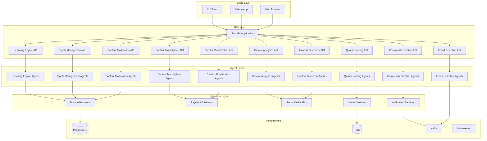
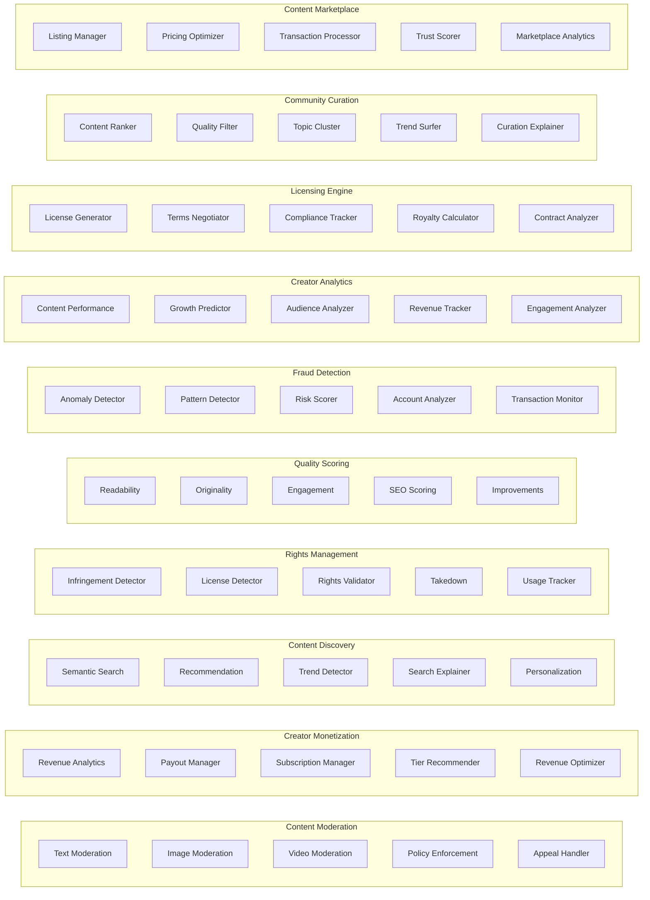
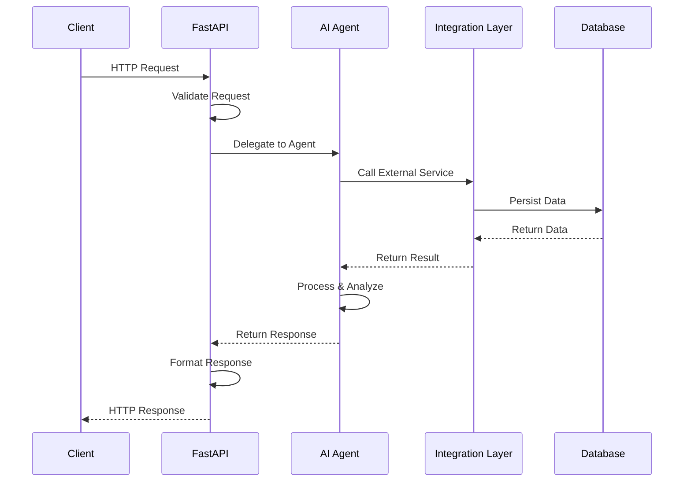
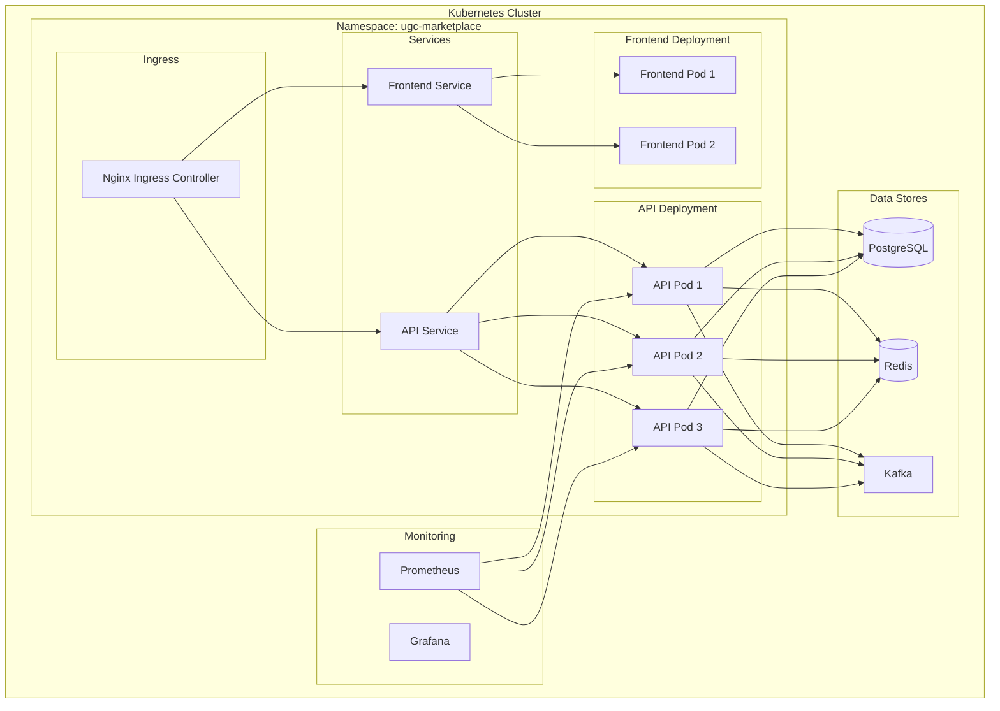
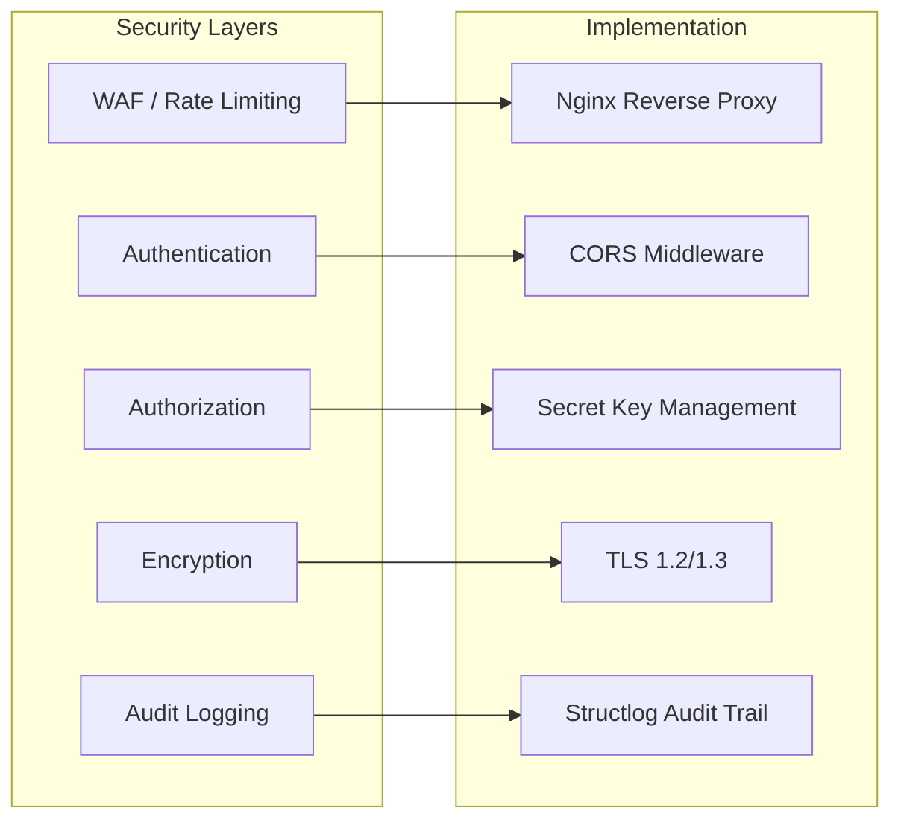
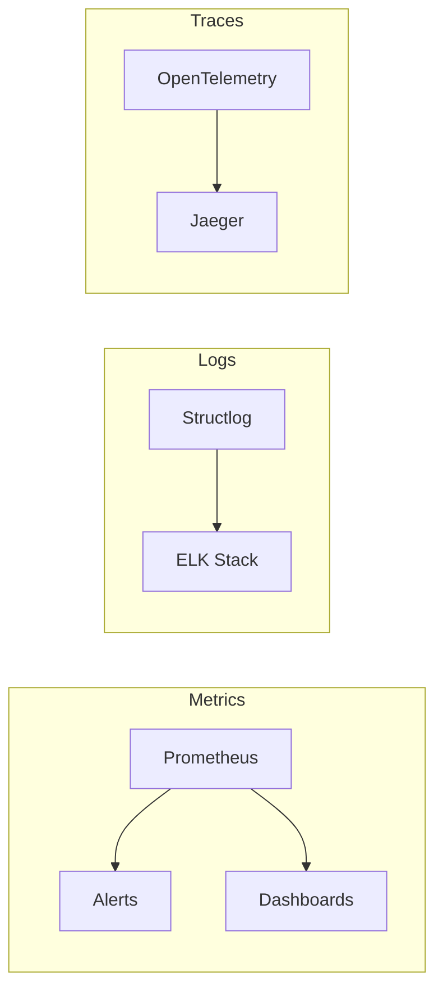

# UGC Marketplace Architecture

## System Overview

UGC Marketplace is a unified agentic AI platform for content marketplace operations. It consolidates 10 separate UGC marketplace projects into a single, standalone, modularized Python project built with FastAPI.

The system follows a layered architecture with clear separation of concerns:

- **API Layer** — FastAPI routers handling HTTP requests
- **Agent Layer** — AI agents performing domain-specific tasks
- **Integration Layer** — External service connectors (storage, payments, social media)
- **Infrastructure** — PostgreSQL, Redis, Kafka, Kubernetes

---

## Architecture Diagram



---

## Module Architecture



---

## Data Flow



---

## Technology Stack

| Layer | Technology | Purpose |
|-------|-----------|---------|
| API Framework | FastAPI | High-performance async web framework |
| Validation | Pydantic v2 | Request/response validation |
| Server | Uvicorn | ASGI server |
| Database | PostgreSQL 16 | Primary data store |
| ORM | SQLAlchemy 2.0 | Async database operations |
| Migrations | Alembic | Database schema migrations |
| Cache | Redis 7 | Caching and session storage |
| Message Queue | Kafka | Event streaming and alerts |
| AI/LLM | LangChain + OpenAI | Agent orchestration and LLM calls |
| Agent Framework | DeepAgents | Multi-agent orchestration |
| Logging | Structlog | Structured logging |
| Frontend | Next.js 14 + React 18 | Web frontend |
| Styling | Tailwind CSS | Utility-first CSS |
| Containerization | Docker | Application packaging |
| Orchestration | Kubernetes | Container orchestration |
| Monitoring | Prometheus | Metrics and alerting |
| CI/CD | GitHub Actions | Automated testing and deployment |

---

## Project Structure

```
ugc-marketplace/
├── src/ugc_marketplace/
│   ├── api/                    # API route handlers
│   │   ├── health.py           # Health check endpoints
│   │   ├── content_moderation/ # Moderation routes
│   │   ├── creator_monetization/ # Monetization routes
│   │   ├── content_discovery/  # Discovery routes
│   │   ├── rights_management/  # Rights routes
│   │   ├── quality_scoring/    # Quality routes
│   │   ├── fraud_detection/    # Fraud routes
│   │   ├── creator_analytics/  # Analytics routes
│   │   ├── licensing_engine/   # Licensing routes
│   │   ├── community_curation/ # Curation routes
│   │   └── content_marketplace/ # Marketplace routes
│   ├── agents/                 # AI agent implementations
│   │   ├── content_moderation/ # Moderation agents
│   │   ├── creator_monetization/ # Monetization agents
│   │   ├── content_discovery/  # Discovery agents
│   │   ├── rights_management/  # Rights agents
│   │   ├── quality_scoring/    # Quality agents
│   │   ├── fraud_detection/    # Fraud agents
│   │   ├── creator_analytics/  # Analytics agents
│   │   ├── licensing_engine/   # Licensing agents
│   │   ├── community_curation/ # Curation agents
│   │   └── content_marketplace/ # Marketplace agents
│   ├── config/                 # Configuration
│   │   ├── __init__.py         # Settings class
│   │   └── logging_config.py   # Logging setup
│   ├── integrations/           # External service integrations
│   │   ├── content_moderation/ # Storage, webhooks
│   │   ├── creator_monetization/ # Stripe, PayPal, Patreon
│   │   ├── creator_analytics/  # YouTube, Twitter, Instagram, TikTok
│   │   ├── content_marketplace/ # Cache, notifications, payments
│   │   ├── fraud_detection/    # Database, Kafka, Redis
│   │   ├── quality_scoring/    # Cache, clients
│   │   ├── rights_management/  # Storage, notifications
│   │   └── community_curation/ # Content fetcher
│   ├── models/                 # Pydantic models
│   │   └── schemas.py          # Shared schemas
│   ├── tests/                  # Test suite
│   │   ├── test_agents/        # Agent tests
│   │   ├── test_api/           # API tests
│   │   ├── test_config/        # Config tests
│   │   └── test_integrations/  # Integration tests
│   ├── __init__.py             # Package init
│   └── main.py                 # Application entry point
├── frontend/                   # Next.js frontend
├── docker/                     # Docker configuration
├── k8s/                        # Kubernetes manifests
├── monitoring/                 # Monitoring config
├── database/                   # Database migrations
├── terraform/                  # Infrastructure as Code
├── pyproject.toml              # Python project config
├── Dockerfile                  # Container build
├── docker-compose.yml          # Local development
└── openapi.json                # OpenAPI specification
```

---

## Deployment Architecture



---

## Security Architecture



---

## Scalability

The system is designed for horizontal scaling:

- **Stateless API pods** — Any pod can handle any request
- **Shared state in Redis** — Session and cache data
- **Database connection pooling** — Async SQLAlchemy with connection pool
- **Kafka for async processing** — Decouple heavy processing
- **HPA (Horizontal Pod Autoscaler)** — Automatic scaling based on CPU/memory
- **Read replicas** — Database read scaling (future)

---

## Monitoring and Observability



---

## Design Principles

1. **Modularity** — Each domain is a self-contained module with its own API, agents, and integrations
2. **Async First** — All I/O operations are async for maximum throughput
3. **Type Safety** — Full type annotations with Pydantic validation
4. **Structured Logging** — Consistent, searchable log format via structlog
5. **Testability** — Comprehensive test suite with pytest
6. **Containerization** — Docker-first development and deployment
7. **Infrastructure as Code** — Kubernetes manifests and Terraform configs
8. **CI/CD** — Automated testing, building, and deployment via GitHub Actions
